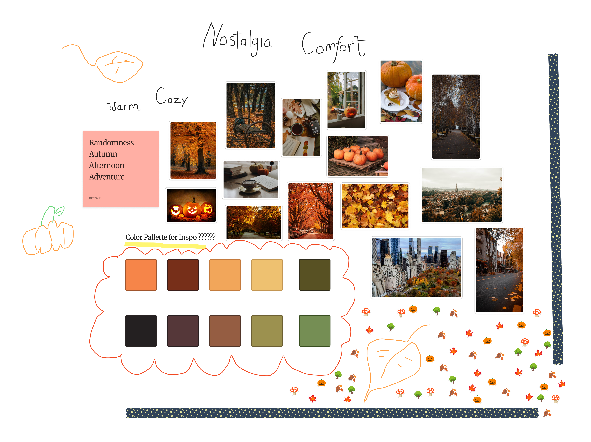
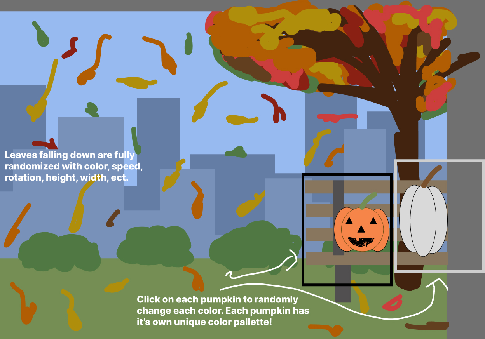

# Arya Aswini's Project 1 for MM216

## Moodboard and Wireframe 
### Moodboard

### Wireframe

## Project Things
### Link to Project

[Project 1](https://aryaariya.github.io/Project1MM621class/)
### Instructions
Click on each of the two pumpkins with your mouse to see them change color - each pumpkin has its own unique color pallatte; they don't share the same colors at all, and the colors are randomly chosen from the color palette. Other than that, just watch the leaves falling down, admire the scenery, and enjoy!

## Project Inspiration 
https://editor.p5js.org/maryamalmatrooshi/sketches/8tY74Enmr

https://thecodingtrain.com/tracks/algorithmic-botany/14-fractal-trees-recursive

https://editor.p5js.org/Ben_Fozzie/sketches/6sCQSzmMi
